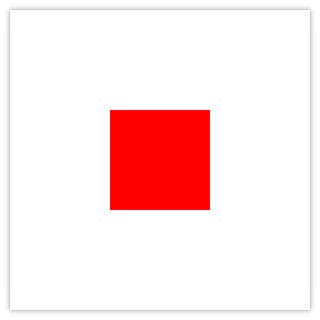
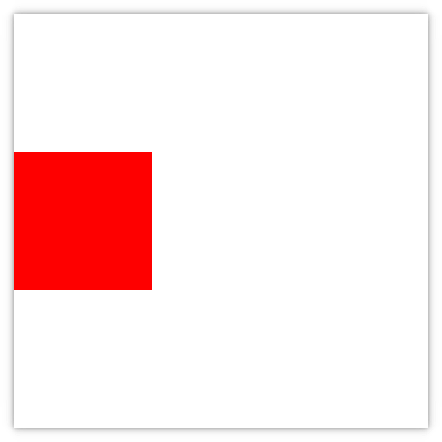
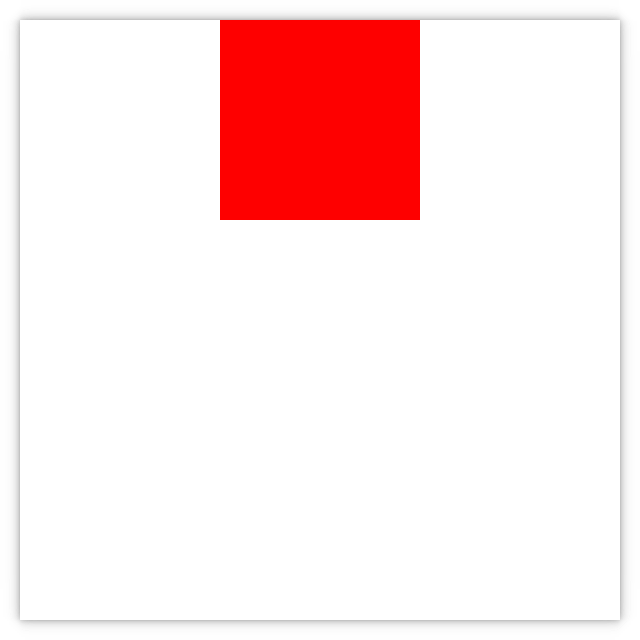
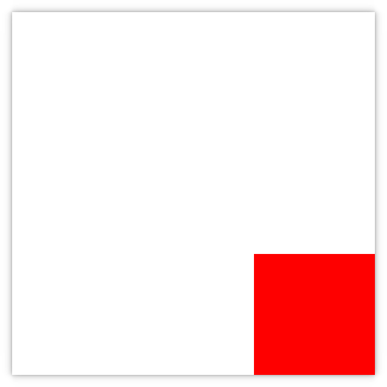
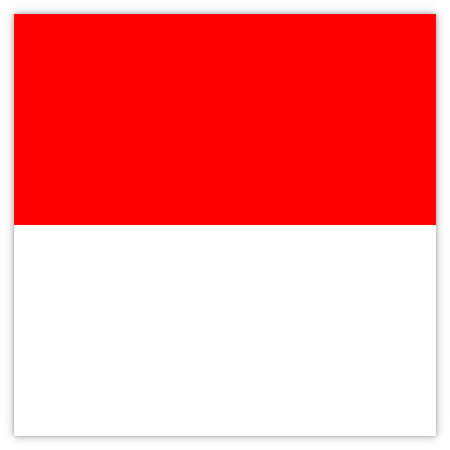
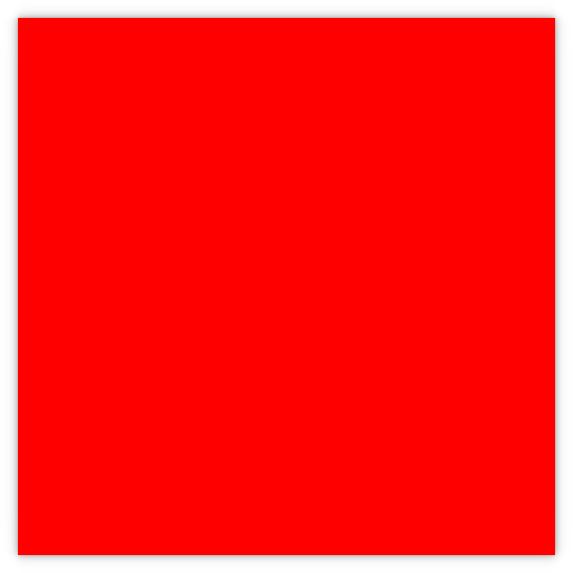
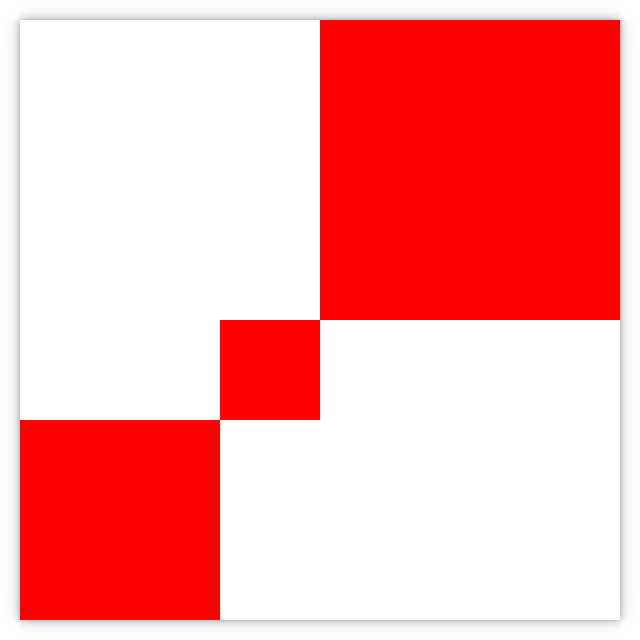
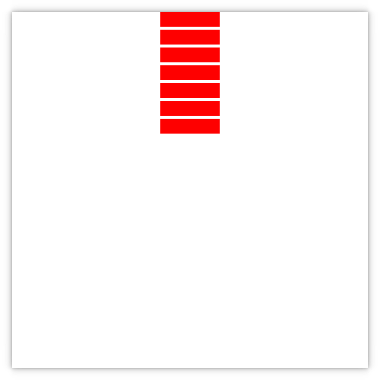
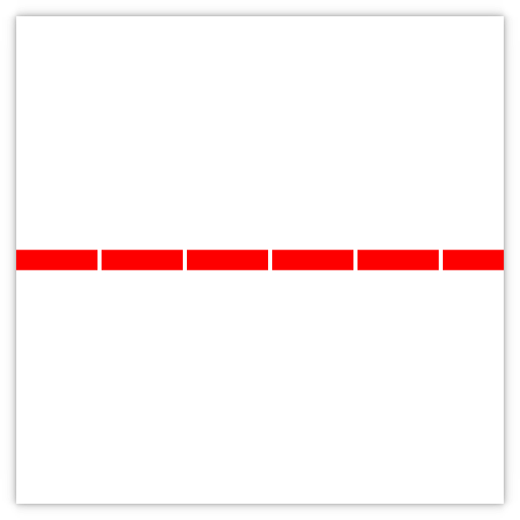
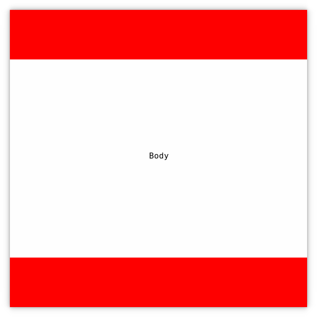

# Ocicat Ui Framework's manual

> WIP

## Table of contents
- [Fundamentals](#fundamentals)
- [Positioning UiNodes](#positioning-uinodes)
  * [Centering](#centering)
  * [Anchors](#anchors)
  * [Rows & Columns](#rows-&-columns)
  * [Traditional Header/Body/Footer](#traditional-headerbodyfooter-example)
- [UiNodes](#uinodes)
  * [Window](#window)
  * [Box](#box)
  * [Text](#text)
  * [Canvas](#canvas)
  * [Image](#image)
  * [Layout](#layout)
- [Widgets](#widgets)
  * [Textbox](#textbox)
  * [Stack](#stack)
  * [List](#list)
- [Tables](#tables)
- [Creating widgets](#creating-widgets)
  * [Declaring](#declaring)
  * [Styling](#styling)

## Fundamentals

All **`UiNode's** use the following shortcuts to assaign/get attributes

- `w`
- `h`
- `size`
- `top`
- `left`
- `bottom`
- `right`
- `margin_top`
- `margin_left`
- `margin_bottom`
- `margin_right`
- `color`
- `update`
- `events`
- `name`

- and two very handy variables
  * `self`
  * `parent`

Nodes are used like so

```nim
box:
  w 20
  h parent.h
```

**Notice how if you resize the parent; the `box`'s `h` doesn't reflect the new parent's `h`. Fix that with an `update:`**

```nim
box:
  color "#ff0000"
  echo("Prints only once for " & node.name() & " on its declaration")
  update:
    size 20, parent.h
```

As the `update:` name suggests, it gets called everytime there's an event or if something useful happens. You can 
alse use `self.trigger_update_attributes()` to immediately trigger it manually

Nodes and widgets also can have `id`'s

```nim
box mycoolbox:
  echo("Prints only once for " & self.name() & " on its declaration")
  update:
    size 20, parent.h
box:
  update:
    left mycoolbox.right
```

## Positioning UiNodes 

###  Centering

<table>

<tr>
<td>

```nim 
box:
  color "#ff0000"
  update:
    size 200, 200
    center parent
```

</td>
<td> </td>
</tr>

<tr>
<td>

```nim 
vcenter parent
```

</td>
<td> </td>
</tr>

<tr>
<td>

```nim 
hcenter parent
```

</td>
<td> </td>
</tr>

</table>

### Anchors

<table>

<tr>
<td>

```nim 
box:
  color "#ff0000"
  update:
    size 200, 200
    bottom parent.bottom
    right parent.right
```

</td>
<td> </td>
</tr>

<tr>
<td>

```nim 
h parent.h / 2
left parent.left
right parent.right
```

</td>
<td> </td>
</tr>

</tr>

<tr>
<td>

```nim 
fill parent
```

</td>
<td> </td>
</tr>

<tr>
<td>

```nim 
box b1:
  color "#ff0000"
  update:
    size 200, 200
    bottom parent.bottom
box b2:
  color "#ff0000"
  update:
    size 100, 100
    bottom b1.top
    left b1.right
box b3:
  color "#ff0000"
  update:
    right parent.right
    top parent.top
    bottom b2.top
    left b2.right
```

</td>
<td> </td>
</tr>

</table>


### Rows & Columns

<table>

<tr>
<td>

```nim 
row:
  update:
    fill parent
  spacing 5
  for i in 0..6:
    box:
      update:
        w 100
        h 25
        center parent
      color "#ff0000"
```

</td>
<td> </td>
</tr>

<tr>
<td>

```nim 
column:
```

</td>
<td> </td>
</tr>

</table>


### Traditional Header/Body/Footer example

<table>

<tr>
<td>

```nim 
box header:
  update:
    size parent.w, 100
  color "#ff0000"
box footer:
  update:
    size parent.w, 100
    bottom parent.bottom
  color "#ff0000"
box body:
  update:
    w parent.w
    top header.bottom
    bottom footer.top
  color "#ffffff"
  text:
    str "Body"
    update:
      fill parent
```

</td>
<td></td>
</tr>

</table>

## UiNodes

### Window

```nim
window win:
  title "My Window"
  size 600, 400
```

**Notice** how the line `size 600, 400` isn't inside an `update:`

The window will not be visible until you call

```nim
win.show()
```

And you can manipulate the platform's window using:

```nim
win.native.move_window(1, 1)
win.native.resize_window(100, 100)
```

**Check** the module `oui/backend.nim` to see what other things you do with a *native* window

### Box

*The most common UiNode*

```nim
box:
  color "#ff0000"
```

The box's default color is white, so it may be invisible until given a different color

And the box's `radius | opacity` can be changed using

```nim
radius 15
opacity 0.5
```

### Text

```nim
text:
  str "Text drawn via pango"
```

You may change both the font family and size by calling `family`

```nim
family "Sans Bold 27"
```

And also align the text with `align UiLeft | UiRight | UiTop | UiBottom | UiCenter`

```nim
valign UiBottom
halign UiRight
```

### Canvas

*The framework uses cairo for all its drawing* 

Heres a helpful tutorial if your unfamilar with **cairo**: https://www.cairographics.org/tutorial/

Do not waste your time drawing outside the canvas's `w` or `h` because everything is clipped

```nim
import cairo

canvas:
  update:
    fill parent
  paint:
    var ctx = self.surface.create()
    ...
```

**Remember `0, 0` is the node's top left, not its `x` and `y`** 

### Layout

> TODO

### Image

```nim
image:
  src "/home/trey/Pictures/naughtysecret.png"
  w 100
  h 100
```

## Widgets

### Textbox

*Useful for grabbing user input*

```nim
var myemailtext = ""
textbox email:
  update:
    size parent.w / 2, parent.h
  events:
    key_press:
      echo myemailtext
do: myemailtext
```

*Useful for password's or other sensitive information*

You can **hide** `myemailtext` with `*` with

```nim
do: myemailtext
do: true
```

### Stack

*Useful for creating pages*

```nim
stack my_page:
  update:
    size parent.w / 2, parent.h
  box box1:
    color "#ff0000"
    visible true # node shown by default
  box box2:
    color "#00ff00"
    visible false # node hidden by default
  box box3:
    color "#0000ff"
    visible false # node hidden by default
```

You switch the displayed node by calling `stack_switch`

```nim
import oui/animation

...
my_page.stack_switch(box2):
  asyncCheck my_page.slide_node(box2, UiRight)
```

Or skip out on animating the transition with the handy `discard` statement

```nim
...(box2):
  discard
```

### List

Check [Tables](#tables) first

```nim
var table = UiTable.init()
...
list customers:
  model table
  delegate:
    box:
      update:
        w parent.w
        h 50
      text:
       str table[self.index][ord CustomerName]
       update:
         fill parent
```

> TODO MORE

## Tables

> Usefull for displaying data

Tables are typically used and displayed with [List's](#list), and can be declared using `decl_table`

```nim
import oui/table
...
decl_table Customer, "name", "age"
``` 

Above declares both an enum, and an *add* proc. Used like so

```nim
var table = UiTable.init()
table.add_customer("Fred", "29")
table.add_customer("Bob", "4")
```

Grab data using

```nim
const index = 0
echo(table[index][ord CustomerName] & " is " & table[index][ord CustomerAge] & " years old"
# Prints 'Fred is 29 years old"
```

## Creating widgets

> P.S widgets are just complicated UiNodes

Heres an example of a simple **button** implementation

```nim 
decl_style button: 
  normal: "#212121"
  hover: "#313113"
  active: "#555555"
decl_widget button, box:
  style: ButtonStyle = button_style
do: 
  color style.normal
  events:
    mouse_enter:
      color style.hover
      self.queue_redraw()
    mouse_leave:
      color style.normal
      self.queue_redraw()
    button_press:
      color style.active
      self.queue_redraw()
    button_release:
      color style.hover
      self.queue_redraw()
```

**More examples can be found in the module** `oui/ui.nim`

Further sections will hopefully explain to you whats going on above; this is just a quick example

### Declaring

Widgets use a convenient macro called `decl_widget` that defines a template declaration for you

```nim
...
decl_widget button, box:
  style: ButtonStyle = button_style
do:
  ...
```

Which expands to

```nim
template button*(id, inner: untyped, style: ButtonStyle = button_style) = 
  box id:
    ...
    inner
```

Widgets can have multiple or even zero *bonus* parameters (not the `id` and `inner` params)

Two examples would be a **Textbox**, and **List**

```nim
...
decl_widget textbox, box:
  password: bool = false
  style: TextboxStyle = textbox_style
do:
  ...
```

```nim
...
decl_widget list, row:
  discard
do:
  ...
```

### Styling

Widgets typically have an optional `style` parameter placed in its declaration, which should always be the **last** parameter

```nim 
decl_style button: 
  normal: "#212121"
  hover: "#313113"
  active: "#555555"
... 
  style: ButtonStyle = button_style
do: 
  ...
```

The `decl_style` macro declared a named tuple called **ButtonStyle**, and a global variable with the name being **button_style** used with every button by default. Values are obviously changeable
```nim
button_style.hover = "#ff0000"
```

Or you may swap out the default style entirely on a per-widget basis

```nim
var better_button_style: ButtonStyle
better_button_style.normal = "#00ff00"
# ...
button btn1:
  update:
    size 100, 50
button btn2:
  update:
    size 100, 50
    left btn1.right
do: better_button_style
```
